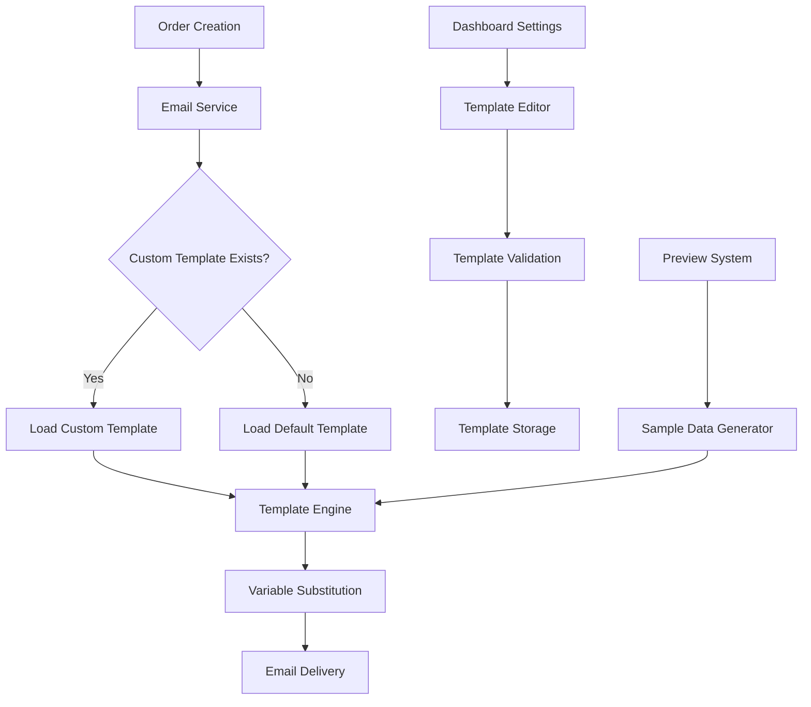

# Customizable Email Templates - Design Document

## Overview

The customizable email templates feature enables store owners to personalize transactional emails sent to customers and themselves during the order process. This system replaces hardcoded email templates with a flexible, organization-specific templating system that maintains professional standards while allowing brand customization.

The solution integrates with the existing LandingChat multi-tenant architecture, where each organization can configure their own email templates while falling back to professional defaults when custom templates are not configured.

## Architecture

### High-Level Architecture



### Component Integration

The email template system integrates with existing LandingChat components:

- **Order Management**: Triggers email sending on order creation/updates
- **Organization Settings**: Provides template configuration interface
- **Multi-tenancy**: Ensures template isolation per organization
- **Payment Gateways**: Includes payment-specific instructions in templates
- **Store Configuration**: Uses store branding and contact information

## Components and Interfaces

### 1. Email Template Storage

**Database Schema Extensions:**
```sql
-- Email templates table
CREATE TABLE email_templates (
  id UUID PRIMARY KEY DEFAULT gen_random_uuid(),
  organization_id UUID NOT NULL REFERENCES organizations(id) ON DELETE CASCADE,
  template_type VARCHAR(50) NOT NULL, -- 'customer_confirmation', 'owner_notification'
  subject_template TEXT NOT NULL,
  html_template TEXT NOT NULL,
  variables JSONB NOT NULL DEFAULT '{}', -- Available variables for this template
  is_active BOOLEAN DEFAULT true,
  created_at TIMESTAMPTZ DEFAULT NOW(),
  updated_at TIMESTAMPTZ DEFAULT NOW(),
  
  UNIQUE(organization_id, template_type)
);

-- Business information for templates
CREATE TABLE organization_email_settings (
  id UUID PRIMARY KEY DEFAULT gen_random_uuid(),
  organization_id UUID NOT NULL REFERENCES organizations(id) ON DELETE CASCADE UNIQUE,
  business_name TEXT,
  contact_email TEXT,
  contact_phone TEXT,
  business_address TEXT,
  payment_instructions TEXT,
  support_message TEXT,
  logo_url TEXT,
  primary_color VARCHAR(7) DEFAULT '#000000',
  created_at TIMESTAMPTZ DEFAULT NOW(),
  updated_at TIMESTAMPTZ DEFAULT NOW()
);
```

### 2. Template Engine Interface

```typescript
interface EmailTemplate {
  id: string;
  organizationId: string;
  templateType: 'customer_confirmation' | 'owner_notification';
  subjectTemplate: string;
  htmlTemplate: string;
  variables: Record<string, string>;
  isActive: boolean;
}

interface EmailTemplateVariables {
  // Order variables
  orderNumber: string;
  orderDate: string;
  orderTotal: string;
  orderItems: OrderItem[];
  orderStatus: string;
  
  // Customer variables
  customerName: string;
  customerEmail: string;
  customerPhone?: string;
  
  // Store variables
  storeName: string;
  storeUrl: string;
  storeLogoUrl?: string;
  
  // Business variables
  businessName: string;
  contactEmail: string;
  contactPhone?: string;
  businessAddress?: string;
  paymentInstructions?: string;
  supportMessage?: string;
}

interface EmailService {
  sendOrderConfirmation(orderId: string, customerId: string): Promise<void>;
  sendOwnerNotification(orderId: string): Promise<void>;
  renderTemplate(templateType: string, variables: EmailTemplateVariables): Promise<string>;
  validateTemplate(template: string): Promise<ValidationResult>;
}
```

### 3. Template Editor Interface

```typescript
interface TemplateEditorProps {
  organizationId: string;
  templateType: 'customer_confirmation' | 'owner_notification';
  initialTemplate?: EmailTemplate;
  onSave: (template: EmailTemplate) => Promise<void>;
  onPreview: (template: string, variables: EmailTemplateVariables) => void;
}

interface TemplatePreview {
  html: string;
  subject: string;
  variables: EmailTemplateVariables;
  errors: ValidationError[];
}
```

## Data Models

### Email Template Model

```typescript
type EmailTemplateType = 'customer_confirmation' | 'owner_notification';

interface EmailTemplate {
  id: string;
  organizationId: string;
  templateType: EmailTemplateType;
  subjectTemplate: string;
  htmlTemplate: string;
  variables: Record<string, any>;
  isActive: boolean;
  createdAt: Date;
  updatedAt: Date;
}

interface OrganizationEmailSettings {
  id: string;
  organizationId: string;
  businessName?: string;
  contactEmail?: string;
  contactPhone?: string;
  businessAddress?: string;
  paymentInstructions?: string;
  supportMessage?: string;
  logoUrl?: string;
  primaryColor: string;
  createdAt: Date;
  updatedAt: Date;
}
```

### Template Variable System

```typescript
interface TemplateVariable {
  key: string;
  description: string;
  type: 'string' | 'number' | 'date' | 'currency' | 'array';
  required: boolean;
  example: string;
}

const CUSTOMER_CONFIRMATION_VARIABLES: TemplateVariable[] = [
  { key: 'customerName', description: 'Customer full name', type: 'string', required: true, example: 'Juan Pérez' },
  { key: 'orderNumber', description: 'Order number', type: 'string', required: true, example: 'ORD-001' },
  { key: 'orderTotal', description: 'Order total amount', type: 'currency', required: true, example: '$150.000' },
  { key: 'orderItems', description: 'List of ordered items', type: 'array', required: true, example: '[Product 1, Product 2]' },
  { key: 'paymentInstructions', description: 'Payment instructions', type: 'string', required: false, example: 'Transfer to account...' },
  // ... more variables
];
```

## Correctness Properties

*A property is a characteristic or behavior that should hold true across all valid executions of a system-essentially, a formal statement about what the system should do. Properties serve as the bridge between human-readable specifications and machine-verifiable correctness guarantees.*

Based on the prework analysis, I'll focus on the most critical properties while eliminating redundancy:

**Property 1: Template validation preserves required variables**
*For any* email template modification, the validation system should ensure that all required variables remain present and properly formatted in the template
**Validates: Requirements 1.2, 4.1**

**Property 2: Organization template isolation**
*For any* organization, saving email templates should store them in isolation such that only that organization can access and use their custom templates
**Validates: Requirements 1.3**

**Property 3: Template selection logic**
*For any* order creation, the system should use the organization's custom template if it exists, otherwise fall back to the default template
**Validates: Requirements 1.4, 1.5**

**Property 4: Template validation error handling**
*For any* invalid template syntax, the validation system should prevent saving and provide specific error messages describing the validation failures
**Validates: Requirements 2.4, 4.4**

**Property 5: Business information propagation**
*For any* business information update, all future emails should automatically reflect the updated information without requiring template re-configuration
**Validates: Requirements 3.3**

**Property 6: Payment instruction inclusion**
*For any* order with manual payment methods, the generated email should include the organization's configured payment instructions
**Validates: Requirements 3.2, 5.3**

**Property 7: Custom domain URL generation**
*For any* organization with custom domains configured, all email links should use the custom domain instead of the default LandingChat domain
**Validates: Requirements 3.5, 5.5**

**Property 8: Template corruption recovery**
*For any* corrupted or invalid template encountered during email generation, the system should fall back to default templates and successfully send the email
**Validates: Requirements 4.5**

**Property 9: Owner notification completeness**
*For any* new order, the owner notification email should include complete order details: customer information, items, payment status, and management links
**Validates: Requirements 6.1, 6.2, 6.3**

**Property 10: Email template round-trip consistency**
*For any* valid email template, saving and then loading the template should preserve all template content and metadata exactly
**Validates: Requirements 1.3**

## Error Handling

### Template Validation Errors

The system handles various template validation scenarios:

1. **Missing Required Variables**: Templates must include essential variables like `{{customerName}}`, `{{orderNumber}}`, `{{orderTotal}}`
2. **Invalid Syntax**: Malformed template syntax (unclosed tags, invalid variable names)
3. **Security Violations**: Templates containing potentially dangerous HTML or JavaScript
4. **Size Limits**: Templates exceeding maximum size limits

### Fallback Mechanisms

```typescript
interface EmailFallbackStrategy {
  // Primary: Use organization's custom template
  useCustomTemplate(organizationId: string, templateType: string): Promise<EmailTemplate | null>;
  
  // Fallback 1: Use default template for template type
  useDefaultTemplate(templateType: string): Promise<EmailTemplate>;
  
  // Fallback 2: Use minimal emergency template
  useEmergencyTemplate(): EmailTemplate;
}
```

### Error Recovery Process

1. **Template Loading Failure**: Fall back to default template
2. **Variable Substitution Error**: Use placeholder values and log error
3. **Email Delivery Failure**: Retry with exponential backoff, alert administrators
4. **Template Corruption**: Automatically restore from backup or use default

## Testing Strategy

### Unit Testing Approach

Unit tests will focus on specific components and edge cases:

- **Template Validation**: Test validation rules with various invalid inputs
- **Variable Substitution**: Test variable replacement with different data types
- **Fallback Logic**: Test fallback behavior when templates are missing or corrupted
- **Email Generation**: Test email generation with various organization configurations

### Property-Based Testing Approach

Property-based tests will verify universal behaviors across all inputs using **fast-check** library with minimum 100 iterations per test:

- **Template Round-Trip**: Generate random valid templates, save and load them, verify consistency
- **Variable Preservation**: Generate templates with various variable combinations, ensure validation preserves required variables
- **Organization Isolation**: Generate multiple organizations with templates, verify no cross-contamination
- **Email Content Consistency**: Generate orders with various configurations, verify emails contain expected content

Each property-based test will be tagged with format: **Feature: customizable-email-templates, Property {number}: {property_text}**

### Integration Testing

- **Email Delivery Pipeline**: Test complete flow from order creation to email delivery
- **Template Editor Integration**: Test template saving and preview functionality
- **Multi-tenant Isolation**: Verify template isolation across organizations

## Implementation Considerations

### Performance Optimizations

1. **Template Caching**: Cache compiled templates per organization to avoid repeated parsing
2. **Variable Pre-computation**: Pre-compute common variables to reduce email generation time
3. **Batch Processing**: Process multiple email sends in batches for efficiency

### Security Measures

1. **Template Sanitization**: Strip potentially dangerous HTML/JavaScript from templates
2. **Variable Validation**: Validate all template variables to prevent injection attacks
3. **Access Control**: Ensure organizations can only access their own templates

### Scalability Considerations

1. **Database Indexing**: Index templates by organization_id and template_type
2. **Template Storage**: Consider external storage for large templates
3. **Email Queue**: Use background job processing for email sending

### Migration Strategy

1. **Default Template Creation**: Create default templates for all existing organizations
2. **Gradual Rollout**: Allow organizations to opt-in to custom templates
3. **Backward Compatibility**: Maintain existing email functionality during transition

## Dependencies

### External Services
- **Email Delivery**: Integration with existing email service (likely Supabase or external SMTP)
- **File Storage**: For template assets and logos (Supabase Storage)

### Internal Dependencies
- **Organization Management**: Access to organization data and settings
- **Order System**: Integration with order creation and management
- **Authentication**: User authentication for template management
- **Multi-tenancy**: Organization isolation and context

### Technical Dependencies
- **Template Engine**: Handlebars.js or similar for variable substitution
- **HTML Sanitization**: DOMPurify or similar for security
- **Email Validation**: Email format and deliverability validation
- **Rich Text Editor**: For template editing interface (likely Tiptap or similar)

## API Design

### Template Management Endpoints

```typescript
// Get organization's email templates
GET /api/dashboard/settings/email-templates
Response: { templates: EmailTemplate[], settings: OrganizationEmailSettings }

// Save email template
POST /api/dashboard/settings/email-templates
Body: { templateType: string, subjectTemplate: string, htmlTemplate: string }
Response: { success: boolean, template: EmailTemplate, errors?: ValidationError[] }

// Preview email template
POST /api/dashboard/settings/email-templates/preview
Body: { template: string, templateType: string, sampleData?: any }
Response: { html: string, subject: string, errors?: ValidationError[] }

// Get available template variables
GET /api/dashboard/settings/email-templates/variables/:templateType
Response: { variables: TemplateVariable[] }

// Update business email settings
PUT /api/dashboard/settings/email-settings
Body: OrganizationEmailSettings
Response: { success: boolean, settings: OrganizationEmailSettings }
```

### Email Sending Integration

```typescript
// Internal email service interface
interface EmailService {
  sendOrderConfirmation(orderId: string): Promise<EmailResult>;
  sendOwnerNotification(orderId: string): Promise<EmailResult>;
  renderTemplate(templateType: string, variables: any, organizationId: string): Promise<string>;
}
```

This design provides a comprehensive foundation for implementing customizable email templates while maintaining the professional standards and multi-tenant architecture of LandingChat.