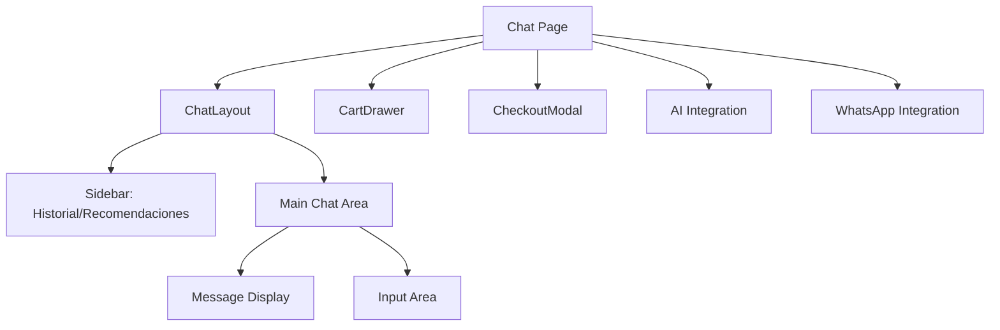
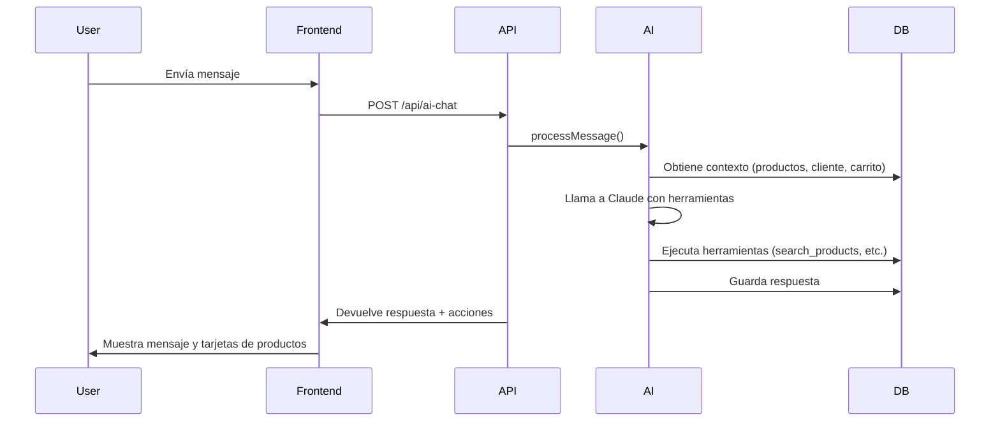
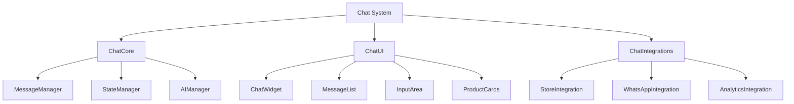
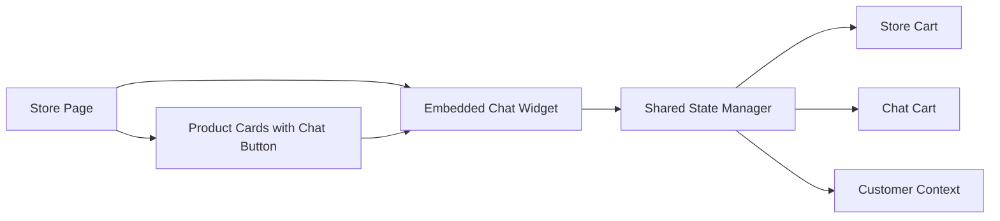

# 🔍 Análisis de Arquitectura del Chat - LandingChat

## 📋 Resumen Ejecutivo

El sistema de chat actual de LandingChat es un sistema conversacional avanzado con integración de IA, pero presenta oportunidades significativas de mejora para una mejor integración en todo el sitio y mayor escalabilidad.

## 🏗️ Arquitectura Actual

### 1. **Estructura de Componentes**



### 2. **Componentes Clave**

#### **Frontend Components**
- **`src/app/chat/[slug]/page.tsx`**: Página principal del chat (600+ líneas)
- **`src/components/layout/chat-layout.tsx`**: Layout con sidebar y header (270 líneas)
- **`src/app/chat/components/cart-drawer.tsx`**: Carrito de compras lateral
- **`src/app/chat/components/checkout-modal.tsx`**: Modal de checkout (480 líneas)

#### **Backend API Routes**
- **`src/app/api/ai-chat/route.ts`**: Procesamiento de mensajes con IA
- **`src/app/api/store/[slug]/chat/init/route.ts`**: Inicialización de chat
- **`src/app/api/store/[slug]/chat/[chatId]/messages/route.ts`**: Historial de mensajes

#### **AI Integration**
- **`src/lib/ai/chat-agent.ts`**: Agente de IA con Claude Sonnet
- **`src/lib/ai/tools.ts`**: 17 herramientas para el agente (búsqueda, carrito, checkout, etc.)
- **`src/lib/ai/tool-executor.ts`**: Ejecución de herramientas

### 3. **Flujo de Trabajo Actual**



## ⚠️ Problemas de Arquitectura Identificados

### 1. **Acoplamiento Excesivo**
- **Problema**: El componente principal del chat (`page.tsx`) tiene 600+ líneas y maneja lógica de negocio, UI, estado, y efectos secundarios
- **Impacto**: Dificulta el mantenimiento y la reutilización
- **Ejemplo**: Lógica de carrito, checkout, mensajes, y AI todo en un solo archivo

### 2. **Falta de Modularidad**
- **Problema**: Los componentes no están diseñados para ser reutilizables en diferentes contextos
- **Impacto**: El chat solo funciona en `/chat/[slug]` y no puede integrarse fácilmente en otras páginas
- **Ejemplo**: No hay un componente `<ChatWidget>` que pueda incrustarse en la tienda

### 3. **Estado Global Complejo**
- **Problema**: Uso de `useCartStore` y `localStorage` para manejar estado del carrito
- **Impacto**: Sincronización compleja entre el chat y la tienda
- **Ejemplo**: El carrito en el chat y en la tienda son instancias separadas

### 4. **Integración AI Rígida**
- **Problema**: La integración con AI está fuertemente acoplada a la estructura actual
- **Impacto**: Dificulta la implementación de nuevos flujos conversacionales
- **Ejemplo**: Las herramientas AI están diseñadas específicamente para el flujo actual

### 5. **Falta de Componentes Reutilizables**
- **Problema**: Componentes como tarjetas de productos, mensajes, y carrito no están diseñados para reutilización
- **Impacto**: Duplicación de código y inconsistencias de UI

### 6. **Rutas de API Monolíticas**
- **Problema**: Las rutas de API son específicas para el chat y no están diseñadas para reutilización
- **Impacto**: Dificulta la integración con otros sistemas

## 🎯 Recomendaciones de Refactorización

### 1. **Modularización del Chat**

**Objetivo**: Dividir el chat en componentes reutilizables y modulares



**Acciones específicas**:
- Crear un componente `<ChatWidget>` que pueda incrustarse en cualquier página
- Separar la lógica de negocio en hooks reutilizables (`useChat`, `useCart`, `useAI`)
- Implementar un sistema de plugins para diferentes integraciones

### 2. **Sistema de Mensajes Modular**

**Problema actual**: Los mensajes y acciones están fuertemente acoplados

**Solución propuesta**:
```typescript
// Sistema de mensajes modular
interface ChatMessage {
    id: string
    role: 'user' | 'assistant'
    content: string
    type: 'text' | 'product' | 'carousel' | 'action'
    data?: any
    metadata?: any
}

// Componentes de mensaje reutilizables
<MessageText message={message} />
<ProductCard product={message.data} />
<Carousel products={message.data} />
```

### 3. **Integración con el Sitio Completo**

**Estrategia de integración**:



**Implementación**:
- Crear un `<ChatButton>` que aparezca en todas las páginas
- Implementar un sistema de estado compartido entre tienda y chat
- Permitir que los productos tengan un botón "Preguntar por este producto" que abra el chat

### 4. **Arquitectura de Plugins**

**Beneficios**: Permite extender el chat sin modificar el núcleo

```typescript
// Sistema de plugins
interface ChatPlugin {
    name: string
    initialize: (chat: ChatInstance) => void
    onMessage: (message: ChatMessage) => ChatMessage | null
    render: (data: any) => React.ReactNode
}

// Ejemplo de plugin de productos
const ProductPlugin: ChatPlugin = {
    name: 'products',
    initialize: (chat) => {
        chat.registerTool('search_products', searchProductsTool)
    },
    onMessage: (message) => {
        if (message.content.includes('producto')) {
            return { ...message, type: 'product_query' }
        }
        return null
    },
    render: (product) => <ProductCard product={product} />
}
```

### 5. **Mejora de la Integración AI**

**Problemas actuales**:
- Las herramientas AI están diseñadas para el flujo actual
- Dificultad para agregar nuevos flujos conversacionales

**Solución**:
- Implementar un sistema de herramientas dinámicas
- Permitir que las herramientas se registren en tiempo de ejecución
- Crear un sistema de middleware para procesar mensajes

```typescript
// Middleware para mensajes AI
const messagePipeline = [
    validateMessage,
    enrichContext,
    applyTools,
    formatResponse
]

async function processMessage(message: string) {
    let result = message
    for (const middleware of messagePipeline) {
        result = await middleware(result)
    }
    return result
}
```

### 6. **Sistema de Estado Unificado**

**Problema**: El estado del carrito y del chat están separados

**Solución**:
```typescript
// Estado unificado
const useUnifiedState = () => {
    const [state, setState] = useState({
        cart: [],
        chat: {
            messages: [],
            currentChatId: null
        },
        customer: null
    })
    
    // Sincronización automática
    useEffect(() => {
        syncWithLocalStorage(state)
        syncWithServer(state)
    }, [state])
    
    return { state, setState, actions }
}
```

## 🚀 Plan de Implementación

### Fase 1: Modularización Básica (2-3 semanas)
1. **Extraer componentes UI**: Separar `MessageList`, `InputArea`, `ProductCards`
2. **Crear hooks reutilizables**: `useChat`, `useCart`, `useMessages`
3. **Implementar ChatWidget**: Componente incrustable básico
4. **Pruebas de integración**: Asegurar que el chat modular funcione igual que el actual

### Fase 2: Integración con el Sitio (3-4 semanas)
1. **Sistema de estado compartido**: Implementar estado unificado
2. **Integración con tienda**: Botones de chat en productos y páginas
3. **Sincronización de carrito**: Asegurar que el carrito sea consistente
4. **Pruebas de usuario**: Validar flujos de compra integrados

### Fase 3: Arquitectura de Plugins (4-5 semanas)
1. **Sistema de plugins**: Implementar arquitectura extensible
2. **Plugins básicos**: Productos, carrito, checkout, soporte
3. **Documentación**: Guía para desarrollar plugins
4. **Pruebas de extensibilidad**: Validar que nuevos plugins funcionen

### Fase 4: Mejoras AI (3-4 semanas)
1. **Middleware de mensajes**: Sistema de procesamiento flexible
2. **Herramientas dinámicas**: Registro en tiempo de ejecución
3. **Nuevos flujos**: Implementar flujos conversacionales avanzados
4. **Pruebas de AI**: Validar que la IA funcione con la nueva arquitectura

## 📊 Beneficios Esperados

| Área | Antes | Después |
|------|-------|---------|
| **Reutilización** | ❌ Componentes específicos | ✅ Componentes modulares |
| **Mantenimiento** | ❌ 600+ líneas en un archivo | ✅ Componentes pequeños y enfocados |
| **Integración** | ❌ Solo en /chat | ✅ En todo el sitio |
| **Extensibilidad** | ❌ Modificar código núcleo | ✅ Sistema de plugins |
| **Consistencia** | ❌ Estados separados | ✅ Estado unificado |
| **Rendimiento** | ❌ Carga completa | ✅ Carga modular |

## 🎯 Impacto en el Negocio

1. **Mayor conversión**: Los clientes pueden chatear desde cualquier página
2. **Mejor experiencia**: Integración fluida entre chat y tienda
3. **Reducción de soporte**: La IA puede manejar más consultas
4. **Escalabilidad**: Fácil de extender con nuevos flujos y características
5. **Mantenimiento**: Código más fácil de mantener y actualizar

## 📚 Recomendaciones Adicionales

1. **Implementar gradual**: Empezar con la modularización básica antes de cambios mayores
2. **Pruebas exhaustivas**: Asegurar que cada fase funcione correctamente antes de continuar
3. **Documentación**: Documentar la nueva arquitectura para el equipo
4. **Capacitación**: Capacitar al equipo en la nueva arquitectura de plugins
5. **Monitoreo**: Implementar monitoreo para detectar problemas de integración

## 🔧 Herramientas Recomendadas

- **State Management**: Zustand o Jotai para estado modular
- **UI Components**: Storybook para documentar componentes reutilizables
- **Testing**: Jest + React Testing Library para pruebas de componentes
- **Documentación**: TypeDoc para documentación de código
- **Monitoreo**: Sentry para detectar errores de integración

Este análisis proporciona una hoja de ruta clara para refactorizar el sistema de chat y lograr una mejor integración en todo el sitio, manteniendo la funcionalidad actual mientras se mejora la arquitectura para mayor escalabilidad y mantenimiento.