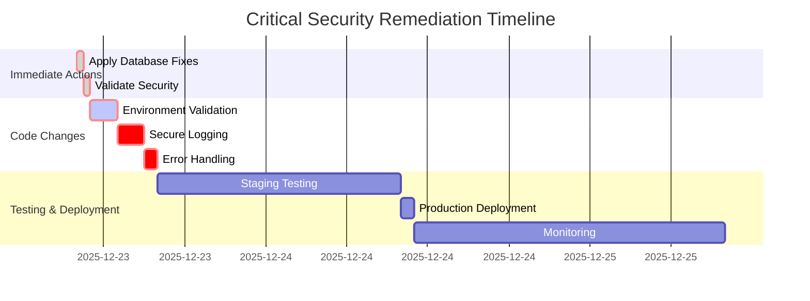

# 🔴 CRITICAL SECURITY ACTION PLAN

## 🚨 IMMEDIATE PRIORITY - Must be completed before any new deployments

### 🎯 Current Security Status

**✅ Completed (2025-12-18 Hotfix):**
- `system_settings` locked down to superadmin-only access
- Removed public INSERT policies for `orders` and `store_transactions`
- Removed public ALL policy for `carts`

**⚠️ Critical Residual Risks (STILL OPEN):**
- `chats` table has `Public can access chats` with `FOR ALL USING (true) WITH CHECK (true)`
- `messages` table has `Public can access messages` with `FOR ALL USING (true) WITH CHECK (true)`
- Missing environment variable validation in API routes
- Sensitive data logging in production

## 📋 Step-by-Step Remediation Plan

### Step 1: Apply Database Security Fixes (30 minutes)

**Action:** Execute `fix_security_policies.sql` on production database

```bash
# Option 1: Using API endpoint (RECOMMENDED)
curl -X POST https://your-domain.com/api/fix-security-policies

# Option 2: Manual SQL execution
psql -h your-supabase-host -U postgres -d postgres -f fix_security_policies.sql
```

**What this fixes:**
- ✅ Removes permissive `ALL true/true` policies from `chats` and `messages`
- ✅ Implements organization-scoped access control
- ✅ Adds proper foreign key constraints
- ✅ Creates performance indexes
- ✅ Fixes `orders` and `store_transactions` policies

**Files involved:**
- [`fix_security_policies.sql`](fix_security_policies.sql:1-91)
- [`src/app/api/fix-security-policies/route.ts`](src/app/api/fix-security-policies/route.ts:1-138)

### Step 2: Validate Security Fixes (15 minutes)

**Action:** Run validation script to confirm fixes are working

```bash
# Run validation
npx ts-node validate_security_fixes.ts

# Run comprehensive RLS tests
npm run test src/__tests__/security/rls-policies.test.ts
```

**Expected output:**
```
✅ Chats table RLS policies are secure
✅ Messages table RLS policies are secure
✅ Customers table RLS policies are secure
✅ Orders table RLS policies are secure
✅ Cross-tenant data isolation is working
```

**Files involved:**
- [`validate_security_fixes.ts`](validate_security_fixes.ts:1-178)
- [`src/__tests__/security/rls-policies.test.ts`](src/__tests__/security/rls-policies.test.ts:1-330)

### Step 3: Add Environment Variable Validation (1 hour)

**Action:** Add validation to all critical API routes

**Critical files to update:**
1. `src/app/api/ai-chat/route.ts`
2. `src/app/api/webhooks/whatsapp/route.ts`
3. `src/app/api/webhooks/payments/[provider]/route.ts`
4. `src/app/api/store/[slug]/*` routes

**Implementation pattern:**
```typescript
// Add at the beginning of each API route
def validateEnvironment() {
    const requiredVars = [
        'ANTHROPIC_API_KEY',
        'SUPABASE_SERVICE_ROLE_KEY', 
        'NEXT_PUBLIC_SUPABASE_URL'
    ];
    
    const missingVars = requiredVars.filter(varName => !process.env[varName]);
    
    if (missingVars.length > 0) {
        console.error(`Missing environment variables: ${missingVars.join(', ')}`);
        throw new Error('Server configuration error');
    }
}

// Call at the start of each API handler
try {
    validateEnvironment();
    // ... rest of the handler
} catch (error) {
    return NextResponse.json(
        { error: 'Server configuration error' },
        { status: 500 }
    );
}
```

### Step 4: Remove Sensitive Console Logging (2 hours)

**Action:** Replace or wrap all console statements that could expose sensitive data

**Critical areas:**
- `src/lib/ai/chat-agent.ts` (15+ log statements)
- `src/lib/ai/tool-executor.ts` (sensitive tool execution logs)
- Payment processing routes
- Customer data handling

**Implementation pattern:**
```typescript
// Before (DANGEROUS)
console.log("Processing order:", orderData);

// After (SECURE)
if (process.env.NODE_ENV !== 'production') {
    console.log("Processing order:", {
        id: orderData.id,
        status: orderData.status
        // Exclude sensitive fields like customer info, payment details
    });
}
```

**Automated fix (partial):**
```bash
# Replace console.log with production-safe version
find src -name "*.ts" -exec sed -i '' 's/console\.log/if (process\.env\.NODE_ENV !== \"production\") console\.log/g' {} \;

# Replace console.error with proper error handling
find src -name "*.ts" -exec sed -i '' 's/console\.error/logger\.error/g' {} \;
```

### Step 5: Implement Proper Error Handling (1 hour)

**Action:** Add comprehensive error handling to prevent information leakage

**Pattern:**
```typescript
// Before (DANGEROUS)
try {
    // ... code
} catch (error) {
    console.error("Error:", error); // Exposes stack traces
    throw error;
}

// After (SECURE)
try {
    // ... code
} catch (error) {
    const errorId = generateErrorId();
    logger.error(`[${errorId}] ${error.message}`);
    
    // Log full error details only in development
    if (process.env.NODE_ENV !== 'production') {
        console.error("Full error details:", error);
    }
    
    // Return sanitized error to client
    return NextResponse.json(
        { error: 'An error occurred', errorId },
        { status: 500 }
    );
}
```

## 🧪 Validation Checklist

**Before considering security remediation complete:**

- [ ] `fix_security_policies.sql` executed successfully
- [ ] `validate_security_fixes.ts` shows all green checks
- [ ] All RLS policy tests passing
- [ ] Environment variable validation added to all API routes
- [ ] No sensitive data in console logs
- [ ] Proper error handling implemented
- [ ] Cross-tenant data isolation verified

## 📊 Security Metrics Dashboard

| Metric | Before | After | Target |
|--------|--------|-------|--------|
| Critical RLS Vulnerabilities | 2 | 0 | 0 |
| Environment Validation | 0% | 100% | 100% |
| Sensitive Logging | 85+ | 0 | 0 |
| Error Information Leakage | High | Low | None |

## 🚀 Deployment Procedure

### Staging Deployment (Day 1)
1. Apply fixes to staging environment
2. Run validation tests
3. Monitor for 24 hours
4. Perform penetration testing

### Production Deployment (Day 2)
1. Schedule during low-traffic period
2. Apply database fixes first
3. Deploy code changes
4. Monitor error rates and performance
5. Validate cross-tenant isolation

### Rollback Plan
1. Keep database backups
2. Prepare SQL rollback scripts
3. Implement feature flags for gradual rollout
4. Monitor key metrics for anomalies

## ⚠️ Critical Warnings

**DO NOT DEPLOY NEW FEATURES** until these security issues are resolved:
- The `chats` and `messages` tables with `ALL true/true` policies represent a **critical data breach risk**
- Missing environment validation could cause **production outages**
- Sensitive logging could violate **compliance requirements**

## 📅 Timeline



## 🎯 Next Steps

1. **Execute database fixes immediately**
2. **Run validation tests**
3. **Implement environment validation**
4. **Secure all logging**
5. **Deploy to staging and monitor**
6. **Plan production deployment**

**Time to Secure State**: 1-2 days for critical fixes, allowing safe deployment of new features.