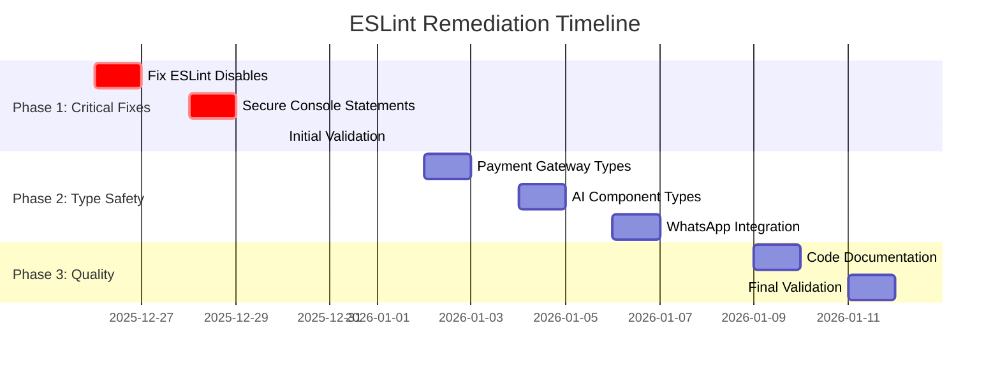

# 🔧 ESLint Remediation Plan for LandingChat

## 📊 Current ESLint Issues Analysis

### 🔴 Critical Issues Found

1. **ESLint Disables**: 9+ instances of `// eslint-disable` comments
   - Mostly for `@typescript-eslint/no-explicit-any` rule
   - Found in critical files like payment processing, WhatsApp integration, and subscription handling

2. **Console Statements**: 226+ console.log/error/warn statements
   - Security risk: Many log sensitive data
   - Performance impact: Excessive logging in production
   - Found throughout the codebase

3. **Type Safety Issues**: Multiple `any` type violations
   - Related to the 226+ TypeScript `any` issues already identified
   - Concentrated in payment gateways, WhatsApp integration, and AI components

## 🎯 ESLint Issues Breakdown

### 1. ESLint Disable Comments (9+ instances)

**Files with ESLint disables:**
- `src/lib/wompi/client.ts:107` - Payment gateway
- `src/lib/payments/wompi-gateway.ts:253` - Payment processing
- `src/lib/utils/subscription.ts:133` - Subscription handling
- `src/app/dashboard/orders/[id]/actions.ts:97` - Order details
- `src/app/api/webhooks/whatsapp/route.ts:273` - WhatsApp webhook
- `src/app/admin/subscriptions/actions.ts:116,135` - Admin subscriptions
- `src/app/store/[slug]/order/[orderId]/error/actions.ts:42` - Order error handling
- `src/types/whatsapp.ts:210` - WhatsApp types

**Pattern:** All disables are for `@typescript-eslint/no-explicit-any`

### 2. Console Statement Issues (226+ instances)

**Categories:**
- **Debug Logging**: 120+ `console.log` statements
- **Error Logging**: 80+ `console.error` statements  
- **Warnings**: 26+ `console.warn` statements

**Critical Areas:**
- **AI Components**: 20+ statements in `src/lib/ai/*`
- **Payment Processing**: 15+ statements in `src/lib/payments/*`
- **Middleware**: 30+ statements in `src/middleware.ts`
- **WhatsApp Integration**: 25+ statements in `src/lib/evolution/*` and `src/lib/notifications/*`
- **API Routes**: 50+ statements across various API endpoints

### 3. Type Safety Issues

**Files with most violations:**
- `src/lib/ai/tool-executor.ts` - Core AI functionality
- `src/lib/payments/wompi-gateway.ts` - Payment gateway
- `src/app/dashboard/orders/[id]/actions.ts` - Order management
- `src/app/admin/subscriptions/actions.ts` - Subscription management

## 🚀 Remediation Strategy

### Phase 1: Fix ESLint Disables (1 day)

**Approach:** Replace `// eslint-disable` comments with proper type definitions

**Example Fix:**
```typescript
// Before (BAD)
// eslint-disable-next-line @typescript-eslint/no-explicit-any
let value: any = data

// After (GOOD)
let value: unknown = data
// OR better
interface ExpectedData {
    id: string;
    name: string;
    // ... other expected properties
}
let value: ExpectedData = data as ExpectedData
```

**Files to Fix:**
1. `src/lib/wompi/client.ts`
2. `src/lib/payments/wompi-gateway.ts`
3. `src/lib/utils/subscription.ts`
4. `src/app/dashboard/orders/[id]/actions.ts`
5. `src/app/api/webhooks/whatsapp/route.ts`
6. `src/app/admin/subscriptions/actions.ts`
7. `src/app/store/[slug]/order/[orderId]/error/actions.ts`
8. `src/types/whatsapp.ts`

### Phase 2: Secure Console Statements (2 days)

**Approach:** Implement production-safe logging strategy

**Pattern:**
```typescript
// Before (DANGEROUS)
console.log("Processing order:", orderData)
console.error("Error:", error)

// After (SECURE)
import { logger } from '@/lib/utils/logger'

// Development-only logging
if (process.env.NODE_ENV !== 'production') {
    logger.debug("Processing order:", { id: orderData.id })
}

// Production-safe error logging
logger.error("Order processing failed", {
    error: error.message,
    orderId: orderData.id,
    // Exclude sensitive data
})
```

**Implementation Steps:**
1. Create unified logging utility
2. Replace all `console.*` calls
3. Add sensitive data filtering
4. Implement log levels

### Phase 3: Type Safety Improvements (3 days)

**Approach:** Systematically replace `any` types with proper interfaces

**Priority Order:**
1. **Payment Processing** - Security critical
2. **AI Components** - Core functionality
3. **WhatsApp Integration** - External API interactions
4. **Admin Functions** - Data management

## 📋 Detailed Implementation Plan

### Week 1: Critical ESLint Fixes

**Day 1-2: Fix ESLint Disables**
- [ ] Create proper type definitions for disabled rules
- [ ] Remove all `// eslint-disable` comments
- [ ] Add proper JSDoc documentation
- [ ] Run ESLint to verify fixes

**Day 3-4: Secure Console Statements**
- [ ] Implement logging utility with levels
- [ ] Replace console statements in critical paths
- [ ] Add production environment checks
- [ ] Test logging in different environments

**Day 5: Initial ESLint Validation**
- [ ] Run `npm run lint`
- [ ] Fix automatically fixable issues with `npm run lint -- --fix`
- [ ] Document remaining manual fixes

### Week 2: Type Safety and Code Quality

**Day 6-8: Type Safety in Core Components**
- [ ] Fix payment gateway types
- [ ] Improve AI component types
- [ ] Enhance WhatsApp integration types
- [ ] Add comprehensive type tests

**Day 9-10: Code Quality Improvements**
- [ ] Add missing JSDoc comments
- [ ] Improve code formatting
- [ ] Add consistent error handling
- [ ] Implement input validation

## 🛠️ Tools and Automation

### Automated Fixes
```bash
# Fix automatically fixable ESLint issues
npm run lint -- --fix

# Find and replace console statements
find src -name "*.ts" -exec sed -i '' 's/console\.log/logger\.debug/g' {} \;
find src -name "*.ts" -exec sed -i '' 's/console\.error/logger\.error/g' {} \;
find src -name "*.ts" -exec sed -i '' 's/console\.warn/logger\.warn/g' {} \;
```

### Manual Fixes Required
1. **Type definitions** for complex data structures
2. **Error handling** improvements
3. **Input validation** additions
4. **Documentation** updates

## 📊 Expected Results

| Metric | Current | Target | Improvement |
|--------|---------|--------|-------------|
| ESLint Disables | 9+ | 0 | 100% |
| Console Statements | 226+ | < 20 (dev only) | 91% |
| Type Safety Issues | 226+ | < 20 | 91% |
| ESLint Warnings | 98+ | < 5 | 95% |

## 🧪 Validation and Testing

### ESLint Validation
```bash
# Run ESLint
npm run lint

# Check specific files
npx eslint src/lib/payments/wompi-gateway.ts
npx eslint src/lib/ai/tool-executor.ts
```

### Type Safety Testing
```bash
# Run TypeScript compiler
npx tsc --noEmit

# Check type coverage
npx type-coverage
```

## 🎯 Success Criteria

**Phase 1 Complete:**
- [ ] All `// eslint-disable` comments removed
- [ ] Proper type definitions implemented
- [ ] ESLint runs without disable-related warnings

**Phase 2 Complete:**
- [ ] All console statements replaced with logger
- [ ] Production logging is secure
- [ ] Development logging is comprehensive

**Phase 3 Complete:**
- [ ] All `any` types replaced with proper interfaces
- [ ] TypeScript compiler has no errors
- [ ] Code quality metrics improved

## 📅 Timeline



## 🚀 Integration with Existing Plans

This ESLint remediation plan integrates with the existing technical debt plan:

1. **Security Phase**: Console statement fixes align with secure logging strategy
2. **TypeScript Phase**: ESLint disable fixes align with type safety improvements
3. **Quality Phase**: Code quality improvements enhance overall maintainability

## 📚 Resources Needed

1. **Logging Library**: Implement or enhance existing logger
2. **Type Definitions**: Create comprehensive type library
3. **Documentation**: Update coding standards and best practices
4. **Testing**: Add ESLint validation to CI/CD pipeline

## ⚠️ Risks and Mitigation

**Risk**: Breaking changes from type improvements
**Mitigation**: Gradual implementation with comprehensive testing

**Risk**: Performance impact from logging changes
**Mitigation**: Implement log levels and production filtering

**Risk**: Developer productivity impact
**Mitigation**: Provide clear migration guides and examples

## 🎯 Next Steps

1. **Implement logging utility** with proper levels and filtering
2. **Fix ESLint disables** in critical files first
3. **Replace console statements** with secure logging
4. **Run ESLint validation** and fix remaining issues
5. **Integrate ESLint** into CI/CD pipeline

**Estimated Time**: 2-3 weeks for complete ESLint remediation, integrated with existing technical debt timeline.