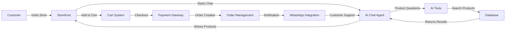
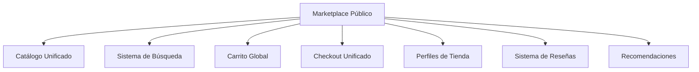
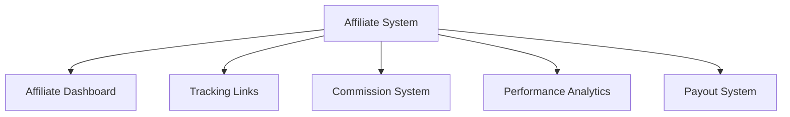
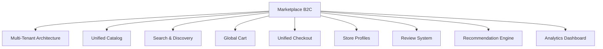
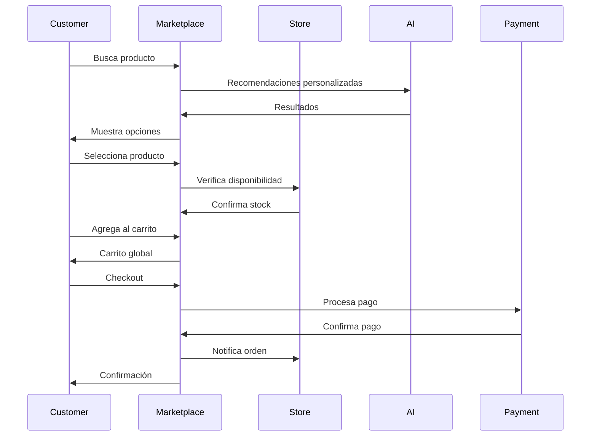
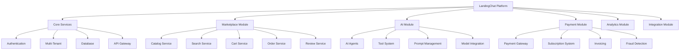
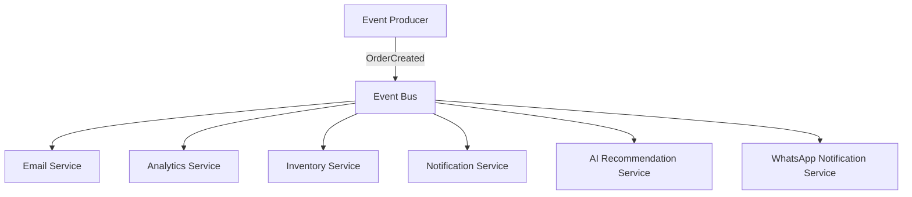
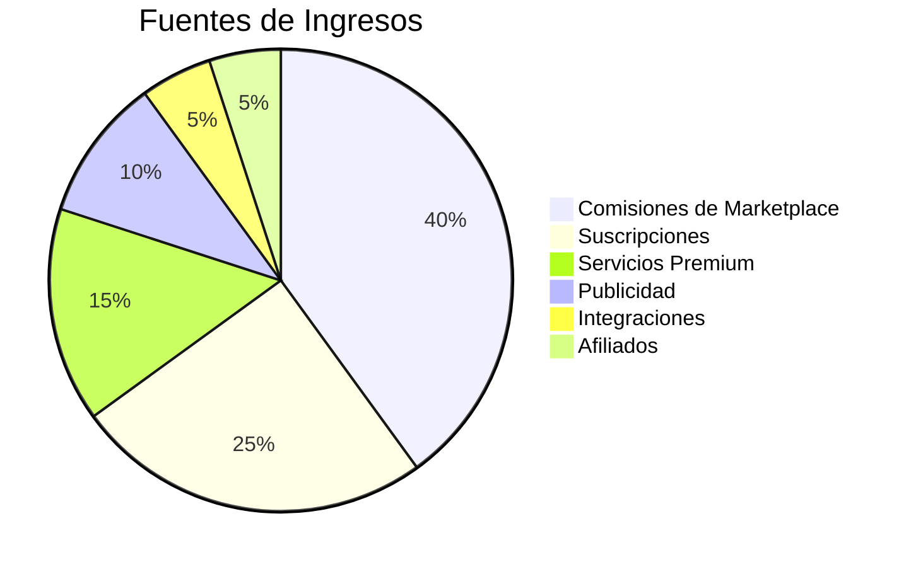

# 🚀 Análisis Estratégico Completo - LandingChat

## 📋 Resumen Ejecutivo

LandingChat es una plataforma de comercio conversacional avanzada con un potencial significativo para convertirse en un líder regional en el espacio de comercio electrónico con IA. Este análisis proporciona una visión completa de la plataforma actual, oportunidades de crecimiento, y una hoja de ruta estratégica para maximizar su potencial.

## 🏗️ Arquitectura Actual de la Plataforma

### 1. **Componentes Principales**

```mermaid
graph TD
    A[LandingChat Platform] --> B[Multi-Tenant Architecture]
    A --> C[AI-Powered Commerce]
    A --> D[WhatsApp Integration]
    A --> E[Marketplace System]
    A --> F[Admin Dashboard]
    A --> G[Storefront Builder]
    
    B --> B1[Organization Management]
    B --> B2[Subdomain Routing]
    B --> B3[RLS Security]
    
    C --> C1[Claude AI Integration]
    C --> C2[17 AI Tools]
    C --> C3[Conversational Chat]
    
    D --> D1[Evolution API]
    D --> D2[Unified Messaging]
    D --> D3[Webhook System]
    
    E --> E1[Agent Templates]
    E --> E2[Channels]
    E --> E3[Features]
    E --> E4[Services]
    
    F --> F1[Analytics]
    F --> F2[Order Management]
    F --> F3[Customer Management]
    F --> F4[Agent Configuration]
```

### 2. **Flujo de Trabajo Actual**

## 🔍 Análisis de Componentes Clave

### 1. **Sistema de Tiendas (Storefront)**

**Fortalezas**:
- ✅ Multi-tenant con subdominios personalizados
- ✅ Constructor visual de tiendas
- ✅ Plantillas personalizables
- ✅ SEO optimizado
- ✅ Integración con Meta Pixel y PostHog

**Oportunidades**:
- 🔧 Mejorar el rendimiento de carga
- 🔧 Implementar A/B testing para plantillas
- 🔧 Sistema de recomendaciones de productos
- 🔧 Integración con más pasarelas de pago
- 🔧 Soporte para múltiples idiomas

### 2. **Sistema de Chat Conversacional**

**Fortalezas**:
- ✅ Integración avanzada con Claude AI
- ✅ 17 herramientas AI para comercio
- ✅ Historial de conversaciones
- ✅ Carrito integrado en el chat
- ✅ Checkout conversacional

**Oportunidades**:
- 🔧 Chat incrustable en todas las páginas
- 🔧 Mejorar la detección de intención
- 🔧 Sistema de recomendaciones contextuales
- 🔧 Integración con CRM externos
- 🔧 Soporte para múltiples idiomas en AI

### 3. **Marketplace Actual**

**Análisis del Marketplace Existente**:

El marketplace actual (`src/app/admin/marketplace/`) es un **marketplace de B2B** que permite a LandingChat vender productos y servicios a sus clientes (tiendas). Actualmente ofrece:

1. **Plantillas de Agentes**: Agentes preconfigurados para diferentes industrias
2. **Canales**: Integraciones con diferentes plataformas
3. **Funcionalidades**: Características adicionales
4. **Servicios**: Servicios profesionales

**Fortalezas del Marketplace Actual**:
- ✅ Sistema de facturación integrado
- ✅ Gestión de suscripciones
- ✅ Configuración flexible de precios
- ✅ Panel de administración completo

**Limitaciones del Marketplace Actual**:
- ❌ Solo para uso interno (LandingChat → Tiendas)
- ❌ No es un marketplace público (Tiendas → Clientes)
- ❌ Falta de sistema de descubrimiento
- ❌ Sin sistema de reseñas y calificaciones
- ❌ Limitado a productos digitales/servicios

### 4. **Sistema de Pagos**

**Fortalezas**:
- ✅ Integración con Wompi y ePayco
- ✅ Soporte para tarjetas, PSE, Nequi
- ✅ Webhooks para notificaciones
- ✅ Manejo de transacciones seguras

**Oportunidades**:
- 🔧 Soporte para pagos recurrentes
- 🔧 Integración con Stripe para mercado internacional
- 🔧 Sistema de cupones y descuentos avanzado
- 🔧 Pagos en múltiples monedas
- 🔧 Financiamiento y pagos a plazos

### 5. **Integración con WhatsApp**

**Fortalezas**:
- ✅ Evolution API para WhatsApp Business
- ✅ Mensajería unificada
- ✅ Notificaciones de pedidos
- ✅ Soporte al cliente

**Oportunidades**:
- 🔧 Chatbot de WhatsApp independiente
- 🔧 Integración con WhatsApp Cloud API
- 🔧 Sistema de tickets de soporte
- 🔧 Automatización de respuestas
- 🔧 Análisis de sentimiento

## 💡 Oportunidades de Negocio y Crecimiento

### 1. **Expansión del Marketplace**

**Oportunidad**: Convertir el marketplace actual en un **marketplace público B2C** donde las tiendas puedan vender a clientes finales.

**Beneficios**:
- 📈 Nuevo modelo de ingresos (comisiones)
- 🌍 Mayor alcance para las tiendas
- 🛒 Experiencia de compra unificada
- 🔄 Efecto de red (más tiendas → más clientes → más tiendas)

**Implementación**:

### 2. **Sistema de Suscripciones Avanzado**

**Oportunidad**: Implementar un sistema de suscripciones para productos físicos y digitales.

**Beneficios**:
- 💰 Ingresos recurrentes predecibles
- 🔄 Mayor retención de clientes
- 📦 Logística optimizada
- 🎁 Experiencia de cliente mejorada

**Ejemplos**:
- Cajas de suscripción mensuales
- Productos de consumo recurrente
- Contenido digital premium
- Membresías exclusivas

### 3. **Expansión Internacional**

**Oportunidad**: Expandir a otros mercados de Latinoamérica con adaptaciones locales.

**Mercados Clave**:
1. **México**: Mercado más grande de LATAM
2. **Brasil**: Mayor población y economía
3. **Argentina**: Alto uso de e-commerce
4. **Perú/Chile**: Mercados en crecimiento

**Adaptaciones Necesarias**:
- 🌐 Soporte multi-idioma (Portugués, Inglés)
- 💱 Múltiples monedas y pasarelas de pago
- 📦 Logística internacional
- 📝 Cumplimiento legal por país

### 4. **Sistema de Afiliados**

**Oportunidad**: Implementar un programa de afiliados para impulsar el crecimiento orgánico.

**Beneficios**:
- 📈 Crecimiento viral
- 💰 Modelo de costo por adquisición
- 🔗 Red de promotores
- 📊 Métricas de rendimiento

**Implementación**:

### 5. **Integración con Redes Sociales**

**Oportunidad**: Venta directa desde redes sociales con integración profunda.

**Plataformas Clave**:
- 📘 Facebook Shops
- 📷 Instagram Shopping
- 🎥 TikTok Shop
- 🐦 Twitter Commerce

**Beneficios**:
- 🎯 Donde están los clientes
- 📱 Experiencia móvil nativa
- 🔗 Tráfico orgánico
- 📊 Datos de comportamiento

### 6. **Sistema de Lealtad y Recompensas**

**Oportunidad**: Implementar un programa de lealtad avanzado.

**Características**:
- 🪙 Puntos por compras
- 🎁 Recompensas personalizadas
- 🏆 Niveles de membresía
- 🎉 Beneficios exclusivos
- 🔄 Programa de referidos

**Beneficios**:
- 🔄 Mayor retención de clientes
- 📈 Aumento en el valor de vida del cliente
- 💰 Mayor frecuencia de compra
- 📊 Datos valiosos de clientes

## 🛒 Análisis de Viabilidad de Marketplace

### 1. **Marketplace B2C Público**

**Viabilidad**: ⭐⭐⭐⭐⭐ (5/5) - Alta viabilidad con la arquitectura actual

**Requerimientos**:

**Arquitectura Propuesta**:

**Modelo de Ingresos**:
1. **Comisión por venta**: 5-15% por transacción
2. **Suscripción premium**: $29-$99/mes para tiendas
3. **Publicidad**: Espacios promocionales
4. **Servicios adicionales**: Logística, marketing, etc.

### 2. **Marketplace de Servicios**

**Viabilidad**: ⭐⭐⭐⭐ (4/5) - Buena oportunidad de diferenciación

**Tipos de Servicios**:
- 🚚 Servicios de logística
- 📦 Embalaje y cumplimiento
- 🎨 Diseño y branding
- 📸 Fotografía de productos
- 📝 Copywriting y marketing

**Beneficios**:
- 🔗 Ecosistema completo para tiendas
- 💰 Nuevas fuentes de ingresos
- 🔄 Mayor retención de clientes
- 🎯 Diferenciación competitiva

### 3. **Marketplace de Aplicaciones**

**Viabilidad**: ⭐⭐⭐⭐ (4/5) - Extensión de la plataforma

**Tipos de Apps**:
- 🔌 Integraciones con ERP
- 📊 Analytics avanzados
- 🤖 Chatbots especializados
- 📧 Email marketing
- 📦 Inventario avanzado

**Beneficios**:
- 🔧 Extensibilidad de la plataforma
- 💡 Innovación por terceros
- 💰 Modelo de ingresos por apps
- 🎯 Atracción de desarrolladores

## 🎯 Arquitectura Ideal para la Plataforma

### 1. **Arquitectura Modular**

### 2. **Sistema de Microservicios**

**Ventajas**:
- 🔧 Desarrollo independiente
- 📈 Escalabilidad por módulo
- 🔄 Actualizaciones sin tiempo de inactividad
- 🔧 Tecnologías específicas por servicio

**Servicios Propuestos**:
1. **User Service**: Autenticación y perfiles
2. **Store Service**: Gestión de tiendas
3. **Product Service**: Catálogo y búsqueda
4. **Order Service**: Procesamiento de pedidos
5. **Payment Service**: Procesamiento de pagos
6. **AI Service**: Procesamiento de lenguaje natural
7. **Chat Service**: Mensajería en tiempo real
8. **Analytics Service**: Recopilación de datos
9. **Notification Service**: Notificaciones push/email
10. **Marketplace Service**: Gestión de marketplace

### 3. **Integración con Event-Driven Architecture**

**Beneficios**:
- 🔗 Desacoplamiento de servicios
- 📈 Escalabilidad horizontal
- 🔄 Resiliencia del sistema
- 📊 Trazabilidad de eventos

## 📈 Hoja de Ruta Estratégica

### Fase 1: Consolidación y Estabilización (3-6 meses)

**Objetivos**:
- ✅ Solucionar problemas de seguridad (ya en progreso)
- ✅ Mejorar la arquitectura del chat
- ✅ Optimizar rendimiento de la plataforma
- ✅ Implementar pruebas automatizadas completas

**Acciones**:
1. **Refactorización del Chat**: Implementar arquitectura modular
2. **Seguridad**: Completar fixes de RLS y validación
3. **Rendimiento**: Optimizar consultas y caching
4. **Pruebas**: Cobertura de tests >80%
5. **Documentación**: Documentación técnica completa

### Fase 2: Expansión del Marketplace (6-12 meses)

**Objetivos**:
- 🛒 Lanzar marketplace B2C público
- 🌍 Expansión a 2 nuevos mercados
- 💰 Implementar sistema de suscripciones
- 🔗 Integraciones con redes sociales

**Acciones**:
1. **Marketplace B2C**: Desarrollo del catálogo unificado
2. **Expansión Internacional**: Adaptación para México
3. **Suscripciones**: Sistema de pagos recurrentes
4. **Redes Sociales**: Integración con Facebook/Instagram
5. **Lealtad**: Programa de puntos y recompensas

### Fase 3: Innovación y Diferenciación (12-18 meses)

**Objetivos**:
- 🤖 AI avanzada con recomendaciones hiper-personalizadas
- 🌐 Plataforma multi-idioma completa
- 📦 Logística integrada
- 💡 Marketplace de aplicaciones

**Acciones**:
1. **AI Avanzada**: Sistema de recomendaciones contextual
2. **Multi-idioma**: Soporte completo para ES/PT/EN
3. **Logística**: Integración con proveedores de envíos
4. **App Marketplace**: Plataforma para desarrolladores
5. **Afiliados**: Programa de afiliados avanzado

### Fase 4: Escalamiento y Optimización (18-24 meses)

**Objetivos**:
- 📈 Escalar a 10,000+ tiendas
- 💰 $1M+ en ingresos mensuales
- 🌍 Presencia en 5+ países
- 🏆 Líder regional en comercio conversacional

**Acciones**:
1. **Escalamiento**: Optimización de infraestructura
2. **Crecimiento**: Campañas de adquisición masiva
3. **Expansión**: Lanzamiento en Brasil
4. **Innovación**: Nuevas características diferenciadoras
5. **Optimización**: Mejorar métricas clave (CAC, LTV, etc.)

## 💰 Modelo de Negocios Recomendado

### 1. **Fuentes de Ingresos**

### 2. **Estrategia de Precios**

**Marketplace B2C**:
- Comisión base: 10%
- Comisión premium (con servicios): 15%
- Suscripción básica: $29/mes
- Suscripción premium: $99/mes

**Servicios Adicionales**:
- Logística integrada: 5-10% del valor del envío
- Marketing: $100-$500 por campaña
- Diseño: $200-$1000 por proyecto
- Consultoría: $50-$150/hora

## 🎯 Recomendaciones Estratégicas Finales

### 1. **Enfoque en el Marketplace B2C**
- **Prioridad Máxima**: El marketplace público tiene el mayor potencial de crecimiento
- **Diferenciación**: Enfocarse en comercio conversacional con AI
- **Experiencia**: Integración perfecta entre chat, tienda y marketplace

### 2. **Inversión en AI**
- **Ventaja Competitiva**: La integración con Claude AI es un diferenciador clave
- **Personalización**: Mejorar las recomendaciones basadas en comportamiento
- **Automatización**: Reducir la necesidad de soporte humano

### 3. **Expansión Internacional**
- **Mercado Objetivo**: México como primer mercado de expansión
- **Adaptación Local**: Soporte para monedas locales y métodos de pago
- **Cumplimiento**: Asegurar cumplimiento legal en cada país

### 4. **Ecosistema Completo**
- **Integraciones**: Conectar con herramientas que las tiendas ya usan
- **Servicios**: Ofrecer servicios complementarios (logística, marketing)
- **Comunidad**: Crear una comunidad de tiendas y desarrolladores

### 5. **Enfoque en Métricas**
- **CAC (Costo de Adquisición)**: Mantener < $50 por tienda
- **LTV (Valor de Vida)**: Objetivo > $1,000 por tienda
- **Churn Rate**: Mantener < 5% mensual
- **NPS (Net Promoter Score)**: Objetivo > 50

## 🚀 Conclusión

LandingChat tiene un potencial enorme para convertirse en un líder regional en comercio conversacional. Con la arquitectura actual como base, y siguiendo esta hoja de ruta estratégica, la plataforma puede:

1. **Escalar** de cientos a miles de tiendas
2. **Diversificar** sus fuentes de ingresos con el marketplace
3. **Innovar** con integración profunda de AI
4. **Expandir** a nuevos mercados internacionales
5. **Diferenciar** con una experiencia de comercio conversacional única

**Recomendación Final**: Iniciar inmediatamente con la Fase 1 (Consolidación) mientras se planifica la Fase 2 (Marketplace B2C), ya que esta última representa la mayor oportunidad de crecimiento y diferenciación en el mercado.

La plataforma ya tiene los cimientos técnicos necesarios - ahora es el momento de escalar el negocio y convertir LandingChat en el estándar de comercio conversacional para Latinoamérica.