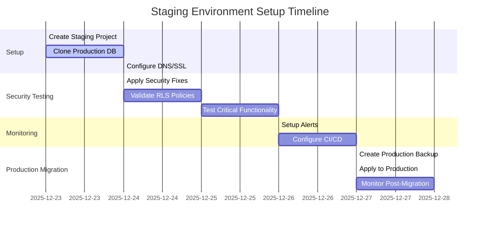

# 🚀 Guía Completa para Configurar Entorno de Staging en Supabase

## 🎯 Objetivo
Crear un entorno de staging seguro para probar todas las correcciones de seguridad y deuda técnica antes de aplicarlas a producción.

## 📋 Paso a Paso para Clonar la Base de Datos de Producción

### Paso 1: Crear un Nuevo Proyecto en Supabase (Staging)

1. **Iniciar sesión** en [Supabase Dashboard](https://app.supabase.com/)
2. **Crear nuevo proyecto**:
   - Nombre: `landingchat-staging`
   - Región: Misma región que producción (para minimizar latencia)
   - Plan: Pro (ya tienes el plan activado)
3. **Configurar variables de entorno**:
   - Copiar todas las variables de entorno de producción
   - Asegurarse de que `NEXT_PUBLIC_SUPABASE_URL` y `SUPABASE_SERVICE_ROLE_KEY` apunten al nuevo proyecto

### Paso 2: Clonar la Estructura de la Base de Datos

```bash
# Instalar Supabase CLI si no lo tienes
npm install -g supabase

# Iniciar sesión en Supabase
supabase login

# Vincular proyecto de producción
supabase link --project-ref tu-proyecto-produccion

# Exportar esquema de producción
supabase db dump --db-url postgresql://postgres:[YOUR-PASSWORD]@[PROD-HOST]:5432/postgres --file production_schema.sql

# Vincular proyecto de staging
supabase link --project-ref landingchat-staging

# Aplicar esquema a staging
supabase db push --db-url postgresql://postgres:[YOUR-PASSWORD]@[STAGING-HOST]:5432/postgres
```

### Paso 3: Configurar Variables de Entorno para Staging

Crear un nuevo archivo `.env.staging`:

```env
# .env.staging
NEXT_PUBLIC_SUPABASE_URL=https://[STAGING-PROJECT-REF].supabase.co
NEXT_PUBLIC_SUPABASE_ANON_KEY=[STAGING-ANON-KEY]
SUPABASE_SERVICE_ROLE_KEY=[STAGING-SERVICE-ROLE-KEY]

# Variables adicionales
ANTHROPIC_API_KEY=[MISMO-QUE-PROD-O-SANDBOX]
NEXT_PUBLIC_APP_URL=https://staging.landingchat.co
MAINTENANCE_MODE=false
```

### Paso 4: Configurar DNS para Staging

1. **Configurar subdominio**:
   - Crear registro CNAME: `staging.landingchat.co` → `[STAGING-PROJECT-REF].supabase.co`
   - Configurar en Supabase Dashboard → Settings → API → Additional Redirect URLs

2. **Configurar SSL**:
   - En Supabase Dashboard → Settings → API → Enable custom domains
   - Subir certificados o usar Let's Encrypt

## 🔧 Aplicar Correcciones de Seguridad en Staging

### Paso 5: Aplicar Fixes de Seguridad

```bash
# Aplicar correcciones de seguridad usando el endpoint API
curl -X POST https://staging.landingchat.co/api/fix-security-policies

# O ejecutar SQL directamente
psql -h [STAGING-HOST] -U postgres -d postgres -f fix_security_policies.sql
```

### Paso 6: Validar las Correcciones

```bash
# Ejecutar script de validación
NEXT_PUBLIC_SUPABASE_URL=https://[STAGING-PROJECT-REF].supabase.co \
SUPABASE_SERVICE_ROLE_KEY=[STAGING-SERVICE-ROLE-KEY] \
npx ts-node validate_security_fixes.ts

# Ejecutar pruebas de RLS
npm run test src/__tests__/security/rls-policies.test.ts
```

### Paso 7: Probar Funcionalidad Crítica

1. **Probar autenticación**:
   - Registrar nuevo usuario en staging
   - Verificar que no pueda acceder a datos de otras organizaciones

2. **Probar chats y mensajes**:
   - Crear nuevos chats
   - Verificar que los mensajes sean privados por organización

3. **Probar pagos**:
   - Usar modo sandbox para pasarelas de pago
   - Verificar que las órdenes sean privadas

4. **Probar integración WhatsApp**:
   - Conectar instancia de prueba
   - Verificar que los mensajes sean privados

## 📋 Checklist de Validación de Staging

- [ ] Base de datos clonada correctamente
- [ ] Variables de entorno configuradas
- [ ] DNS y SSL configurados
- [ ] Correcciones de seguridad aplicadas
- [ ] Validación de RLS exitosa
- [ ] Pruebas de autenticación pasadas
- [ ] Pruebas de chats/mensajes pasadas
- [ ] Pruebas de pagos pasadas
- [ ] Pruebas de WhatsApp pasadas
- [ ] Monitoreo configurado
- [ ] Backups automatizados

## 🔄 Estrategia de Migración a Producción

### Paso 8: Plan de Migración Segura

1. **Crear backup de producción**:
   ```bash
   # Crear backup completo
   supabase db dump --db-url postgresql://postgres:[PASSWORD]@[PROD-HOST]:5432/postgres --file prod_backup_$(date +%Y%m%d).sql
   
   # Guardar en almacenamiento seguro
   aws s3 cp prod_backup_$(date +%Y%m%d).sql s3://landingchat-backups/
   ```

2. **Aplicar fixes en producción durante ventana de mantenimiento**:
   ```bash
   # Aplicar correcciones de seguridad
   curl -X POST https://landingchat.co/api/fix-security-policies
   
   # Validar inmediatamente
   npx ts-node validate_security_fixes.ts
   ```

3. **Monitorear post-migración**:
   - Verificar métricas de error
   - Monitorear rendimiento
   - Revisar logs de seguridad
   - Validar que no haya regresiones

## 🛠️ Configuración de CI/CD para Staging

### Paso 9: Configurar Pipeline de Staging

```yaml
# .github/workflows/staging-deploy.yml
name: Deploy to Staging

on:
  push:
    branches: [ staging ]

jobs:
  deploy:
    runs-on: ubuntu-latest
    environment: staging
    steps:
      - uses: actions/checkout@v4
      
      - name: Install dependencies
        run: npm install
      
      - name: Run ESLint
        run: npm run lint
      
      - name: Run tests
        run: npm run test
      
      - name: Build
        run: npm run build
        env:
          NEXT_PUBLIC_SUPABASE_URL: ${{ secrets.STAGING_SUPABASE_URL }}
          NEXT_PUBLIC_SUPABASE_ANON_KEY: ${{ secrets.STAGING_SUPABASE_ANON_KEY }}
          SUPABASE_SERVICE_ROLE_KEY: ${{ secrets.STAGING_SERVICE_ROLE_KEY }}
      
      - name: Deploy to Vercel
        run: npx vercel --prod --token ${{ secrets.VERCEL_TOKEN }}
```

## 📊 Monitoreo y Alertas

### Paso 10: Configurar Monitoreo

1. **Configurar alertas en Supabase**:
   - Dashboard → Settings → Alerts
   - Configurar alertas para:
     - Alto uso de CPU
     - Errores de consulta
     - Fallos de autenticación
     - Tráfico inusual

2. **Configurar logging centralizado**:
   ```bash
   # Instalar y configurar logger
   npm install winston winston-daily-rotate-file
   
   # Configurar logger para staging
   const logger = createLogger({
     level: 'debug',
     transports: [
       new DailyRotateFile({
         filename: 'logs/staging-%DATE%.log',
         datePattern: 'YYYY-MM-DD',
         maxSize: '20m',
         maxFiles: '14d'
       })
     ]
   });
   ```

## 🚀 Comando Rápido para Configuración Inicial

```bash
# 1. Clonar repositorio y configurar staging
git clone https://github.com/tu-usuario/landingchat.git landingchat-staging
cd landingchat-staging

# 2. Instalar dependencias
npm install

# 3. Configurar variables de entorno
cp .env.example .env.staging
# Editar .env.staging con credenciales de staging

# 4. Aplicar correcciones de seguridad
curl -X POST http://localhost:3000/api/fix-security-policies

# 5. Validar
npx ts-node validate_security_fixes.ts

# 6. Ejecutar en modo staging
npm run dev -- --env-file=.env.staging
```

## ⚠️ Checklist de Seguridad Pre-Despliegue

**Antes de aplicar cualquier cambio a producción:**

- [ ] Todos los tests pasan en staging
- [ ] Validación de RLS exitosa
- [ ] Backups de producción verificados
- [ ] Ventana de mantenimiento comunicada
- [ ] Equipo de soporte en standby
- [ ] Plan de rollback documentado
- [ ] Monitoreo configurado
- [ ] Alertas configuradas

## 📅 Timeline Recomendado



## 🎯 Beneficios del Entorno de Staging

1. **Seguridad**: Pruebas sin riesgo para producción
2. **Validación**: Confirmar que los fixes de seguridad funcionan
3. **Colaboración**: Equipo puede probar sin afectar usuarios reales
4. **CI/CD**: Pipeline de integración continua para validación automática
5. **Monitoreo**: Detectar problemas antes de que afecten producción

## 🚨 Plan de Rollback

**Si algo sale mal en producción:**

```bash
# 1. Revertir cambios de seguridad
psql -h [PROD-HOST] -U postgres -d postgres -f rollback_security_fixes.sql

# 2. Restaurar desde backup
supabase db restore prod_backup_$(date +%Y%m%d).sql --db-url postgresql://postgres:[PASSWORD]@[PROD-HOST]:5432/postgres

# 3. Comunicar al equipo
# Usar canal de emergencia en Slack/Teams
```

## 📚 Recursos Adicionales

- **Documentación de Supabase**: https://supabase.com/docs
- **Guía de CLI**: https://supabase.com/docs/guides/cli
- **Best Practices**: https://supabase.com/docs/guides/best-practices

Con este entorno de staging configurado, podemos aplicar todas las correcciones de seguridad y deuda técnica de manera segura antes de llevarlas a producción.