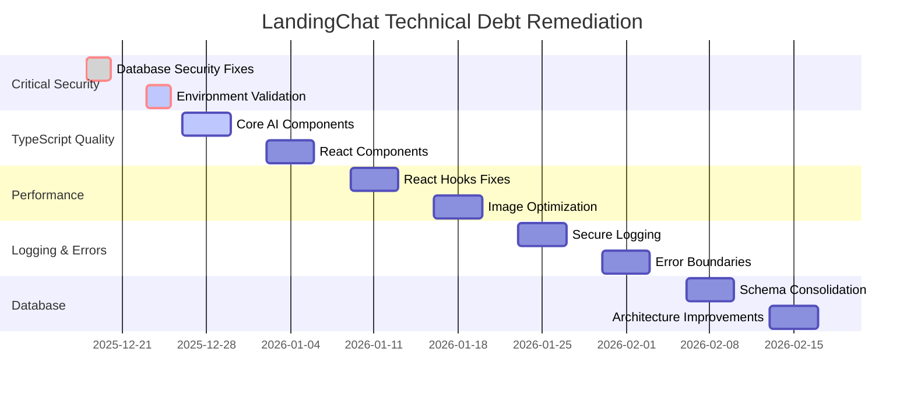

# 🚀 LandingChat Technical Debt Remediation Plan

## 📋 Executive Summary

The LandingChat project has accumulated significant technical debt across multiple areas including security, TypeScript type safety, React performance, logging, and database optimization. This plan outlines a structured approach to systematically address these issues.

### 🔴 Current State Analysis

**Critical Issues Identified:**
- **Security**: 5+ critical vulnerabilities (RLS misconfigurations, data exposure)
- **TypeScript**: 226+ `any` type violations
- **React**: 15+ hook violations causing performance issues
- **Logging**: 85+ console statements with sensitive data exposure risk
- **Database**: Schema inconsistencies and migration issues

## 🎯 Phase 1: Critical Security Remediation (Immediate - 1 Week)

### 1.1 Database Security Fixes
**Status**: ✅ Partially Completed (Hotfix applied 2025-12-18)

**Actions:**
- [x] Apply `fix_security_policies.sql` to production
- [x] Remove permissive RLS policies from `chats` and `messages` tables
- [x] Implement organization-scoped policies
- [ ] Add foreign key constraints and indexes
- [ ] Validate fixes with `validate_security_fixes.ts`

**Files Involved:**
- [`fix_security_policies.sql`](fix_security_policies.sql)
- [`src/app/api/fix-security-policies/route.ts`](src/app/api/fix-security-policies/route.ts)
- [`src/__tests__/security/rls-policies.test.ts`](src/__tests__/security/rls-policies.test.ts)

### 1.2 Environment Variable Validation
**Status**: ⚠️ Partial

**Actions:**
- [ ] Add validation for `ANTHROPIC_API_KEY`, `SUPABASE_SERVICE_ROLE_KEY`, `NEXT_PUBLIC_SUPABASE_URL`
- [ ] Implement proper error handling in API routes
- [ ] Create validation middleware

**Priority Files:**
- `src/app/api/ai-chat/route.ts`
- `src/app/api/webhooks/*`
- `src/app/api/store/[slug]/*`

## 🎯 Phase 2: TypeScript Quality Improvements (Week 2-3)

### 2.1 Eliminate `any` Types
**Status**: ❌ Not Started

**Critical Files to Fix:**
1. [`src/lib/ai/chat-agent.ts`](src/lib/ai/chat-agent.ts) - Core AI functionality
2. [`src/lib/ai/tool-executor.ts`](src/lib/ai/tool-executor.ts) - Tool execution logic
3. [`src/app/api/ai-chat/route.ts`](src/app/api/ai-chat/route.ts) - Main API endpoint
4. [`src/app/store/[slug]/producto/[slugOrId]/product-detail-client.tsx`](src/app/store/[slug]/producto/[slugOrId]/product-detail-client.tsx)
5. [`src/hooks/use-is-subdomain.ts`](src/hooks/use-is-subdomain.ts)

**Approach:**
- Replace `any` with proper interfaces
- Use `unknown` for dynamic data
- Add Zod validation schemas
- Implement type guards

### 2.2 Fix React Hook Violations
**Status**: ❌ Not Started

**Issues Found:**
- Synchronous `setState` calls causing cascading renders
- Missing dependency arrays
- Improper use of effects

**Files to Fix:**
- [`src/app/store/[slug]/producto/[slugOrId]/product-detail-client.tsx`](src/app/store/[slug]/producto/[slugOrId]/product-detail-client.tsx)
- [`src/app/store/[slug]/store-layout-client.tsx`](src/app/store/[slug]/store-layout-client.tsx)
- [`src/hooks/use-is-subdomain.ts`](src/hooks/use-is-subdomain.ts)

## 🎯 Phase 3: Performance Optimization (Week 4)

### 3.1 React Performance Fixes
**Actions:**
- [ ] Fix synchronous state updates in effects
- [ ] Add proper dependency arrays
- [ ] Implement `useCallback` and `useMemo` where needed
- [ ] Optimize rendering with React.memo

### 3.2 Image Optimization
**Actions:**
- [ ] Replace 15+ `` tags with Next.js `<Image />` component
- [ ] Implement proper image sizing and lazy loading
- [ ] Add CDN optimization

### 3.3 Bundle Size Reduction
**Actions:**
- [ ] Analyze bundle composition
- [ ] Implement code splitting
- [ ] Remove unused dependencies
- [ ] Optimize third-party libraries

## 🎯 Phase 4: Logging and Error Handling (Week 5)

### 4.1 Secure Logging Implementation
**Actions:**
- [ ] Replace 85+ `console.log` statements with production-safe logging
- [ ] Implement logging levels (debug, info, warn, error)
- [ ] Add sensitive data filtering
- [ ] Implement log rotation and retention

**Approach:**
```typescript
// Before (DANGEROUS)
console.log("User data:", user)

// After (SECURE)
if (process.env.NODE_ENV !== 'production') {
    logger.debug("User data:", { id: user.id, name: user.name })
}
```

### 4.2 Error Boundaries
**Actions:**
- [ ] Add React error boundaries
- [ ] Implement global error handling
- [ ] Add error tracking (Sentry/LogRocket)
- [ ] Create user-friendly error pages

## 🎯 Phase 5: Database and Architecture (Week 6-7)

### 5.1 Database Schema Consolidation
**Actions:**
- [ ] Consolidate migration files (`schema.sql`, `update_schema_*.sql`)
- [ ] Resolve overlapping/duplicate definitions
- [ ] Implement proper foreign key constraints
- [ ] Add missing indexes for performance

### 5.2 Architecture Improvements
**Actions:**
- [ ] Implement proper error boundaries
- [ ] Add comprehensive API validation
- [ ] Implement request/response logging
- [ ] Add rate limiting

## 📊 Implementation Timeline



## 🔧 Implementation Strategy

### 1. Security First Approach
- **Immediate Action**: Apply remaining security fixes
- **Validation**: Run comprehensive RLS policy tests
- **Monitoring**: Implement security monitoring

### 2. Incremental TypeScript Improvements
- **Priority**: Fix core AI components first
- **Pattern**: Use the provided `src_lib_ai_chat_agent_fixed.ts` as template
- **Validation**: Run `npm run lint` after each fix

### 3. Performance Optimization
- **Tooling**: Use React DevTools for profiling
- **Metrics**: Track bundle size and render times
- **Validation**: Implement performance tests

### 4. Logging Strategy
- **Production Safety**: Wrap all console statements
- **Levels**: Implement proper logging levels
- **Filtering**: Remove sensitive data from logs

## 🧪 Testing and Validation

### Security Testing
```bash
# Run RLS policy tests
npm run test src/__tests__/security/rls-policies.test.ts

# Validate security fixes
npx ts-node validate_security_fixes.ts
```

### TypeScript Validation
```bash
# Run linter
npm run lint

# Fix automatically fixable issues
npm run lint -- --fix
```

### Performance Testing
```bash
# Run performance tests
npm run test:performance

# Analyze bundle
npm run analyze
```

## 📈 Success Metrics

| Category | Current | Target | Status |
|----------|---------|--------|--------|
| Security Vulnerabilities | 5+ | 0 | ⚠️ Partial |
| TypeScript `any` Types | 226+ | < 20 | ❌ Not Started |
| React Hook Violations | 15+ | 0 | ❌ Not Started |
| Console Logging | 85+ | < 10 (dev only) | ❌ Not Started |
| Lint Warnings | 98 | < 5 | ❌ Not Started |

## 🚀 Deployment Readiness Checklist

**Before Production Deployment:**
- [ ] All critical security fixes applied
- [ ] Environment variables validated
- [ ] Sensitive logging removed/protected
- [ ] No `any` types in critical paths
- [ ] React hooks have proper dependencies
- [ ] All linting errors resolved
- [ ] Performance tests passing
- [ ] Security tests passing

## ⚠️ Risk Assessment

**High Risk Areas:**
1. **Database Security**: Cross-tenant data exposure if RLS not properly configured
2. **AI Components**: Type safety issues could cause runtime errors in core functionality
3. **Payment Processing**: Logging sensitive data could violate compliance

**Mitigation Strategies:**
- Implement comprehensive test coverage for security fixes
- Gradual rollout with feature flags
- Monitor error rates and performance metrics
- Implement automated rollback procedures

## 📚 Resources

- **Security Audit Report**: [`SECURITY_AUDIT_REPORT.md`](SECURITY_AUDIT_REPORT.md)
- **Security Fixes Summary**: [`SECURITY_FIXES_SUMMARY.md`](SECURITY_FIXES_SUMMARY.md)
- **TypeScript Fix Example**: [`src_lib_ai_chat_agent_fixed.ts`](src_lib_ai_chat_agent_fixed.ts)
- **Test Files**: [`src/__tests__/security/rls-policies.test.ts`](src/__tests__/security/rls-policies.test.ts)

## 🎯 Next Immediate Actions

1. **Apply remaining security fixes** using `fix_security_policies.sql`
2. **Run validation tests** with `validate_security_fixes.ts`
3. **Fix TypeScript issues** in core AI components
4. **Implement environment validation** in all API routes
5. **Replace sensitive console logging** with production-safe alternatives

**Estimated Time to Secure State**: 1-2 weeks for critical fixes, 4-6 weeks for full remediation.