# 🎯 LandingChat Technical Debt Remediation - Executive Summary

## 🚨 Current Situation

The LandingChat project has accumulated **critical technical debt** that must be addressed immediately. The system currently has:

### 🔴 Critical Security Issues (MUST FIX NOW)
1. **Database Security**: `chats` and `messages` tables have `FOR ALL USING (true) WITH CHECK (true)` policies - **ANYONE can read/write all chats and messages across all organizations**
2. **Missing Environment Validation**: API routes don't validate required environment variables
3. **Sensitive Data Logging**: 85+ console statements that could expose sensitive data in production

### 🟡 High Priority Code Quality Issues
1. **TypeScript Safety**: 226+ `any` type violations (especially in core AI components)
2. **React Performance**: 15+ hook violations causing cascading renders
3. **Image Optimization**: 15+ `` tags instead of Next.js `<Image />`
4. **ESLint Issues**: 9+ `// eslint-disable` comments and 226+ console statements

### 🟢 Lower Priority Issues
1. **Database Schema**: Migration file inconsistencies
2. **Error Boundaries**: Missing comprehensive error handling
3. **Bundle Size**: Performance optimization opportunities

## 🚀 Immediate Action Plan (Next 48 Hours)

### Step 1: Apply Critical Security Fixes (30 minutes)
```bash
# Apply database security fixes
curl -X POST https://your-domain.com/api/fix-security-policies

# OR manually execute SQL
psql -h your-supabase-host -U postgres -d postgres -f fix_security_policies.sql
```

**What this fixes:**
- ✅ Removes dangerous `ALL true/true` policies from chats and messages
- ✅ Implements organization-scoped access control
- ✅ Adds proper foreign key constraints and indexes

### Step 2: Validate Security (15 minutes)
```bash
# Run validation
npx ts-node validate_security_fixes.ts

# Run security tests
npm run test src/__tests__/security/rls-policies.test.ts
```

### Step 3: Add Environment Validation (1 hour)
Add this to all critical API routes:

```typescript
// src/lib/validate-environment.ts
function validateEnvironment() {
    const requiredVars = [
        'ANTHROPIC_API_KEY',
        'SUPABASE_SERVICE_ROLE_KEY', 
        'NEXT_PUBLIC_SUPABASE_URL'
    ];
    
    const missingVars = requiredVars.filter(varName => !process.env[varName]);
    
    if (missingVars.length > 0) {
        throw new Error('Server configuration error');
    }
}
```

### Step 4: Secure Logging (2 hours)
Replace all console statements:

```bash
# Automated partial fix
find src -name "*.ts" -exec sed -i '' 's/console\.log/if (process\.env\.NODE_ENV !== \"production\") console\.log/g' {} \;
```

## 📅 Detailed Remediation Timeline

```mermaid
gantt
    title Technical Debt Remediation Timeline
    dateFormat  YYYY-MM-DD
    
    section 🔴 CRITICAL (Must do NOW)
    Database Security       :crit, active, 2025-12-23, 2025-12-23
    Environment Validation  :crit,         2025-12-23, 2025-12-24
    Secure Logging          :crit,         2025-12-24, 2025-12-24
    
    section 🟡 HIGH PRIORITY (Next 2 weeks)
    TypeScript Core Files   :active,        2025-12-26, 2025-12-30
    React Performance       :               2026-01-02, 2026-01-06
    Image Optimization      :               2026-01-09, 2026-01-13
    
    section 🟢 MEDIUM PRIORITY (Next month)
    Database Schema         :               2026-01-16, 2026-01-20
    Error Boundaries        :               2026-01-23, 2026-01-27
    Bundle Optimization     :               2026-01-30, 2026-02-03
```



## 📊 Progress Tracking

| Area | Current Status | Target | ETA |
|------|---------------|--------|-----|
| **Security** | ⚠️ Partial | ✅ Secure | 2 days |
| **TypeScript** | ❌ Poor | ✅ Excellent | 2 weeks |
| **Performance** | ⚠️ Adequate | ✅ Optimized | 3 weeks |
| **Logging** | ❌ Dangerous | ✅ Secure | 1 day |
| **Overall** | ❌ High Risk | ✅ Production Ready | 4-6 weeks |

## 🔧 Key Resources Created

1. **📋 Comprehensive Plan**: [`TECHNICAL_DEBT_REMEDIATION_PLAN.md`](TECHNICAL_DEBT_REMEDIATION_PLAN.md)
   - Detailed 6-phase remediation plan
   - Timeline, metrics, and validation procedures
   - Success criteria and deployment checklist

2. **🔴 Critical Security Plan**: [`CRITICAL_SECURITY_ACTION_PLAN.md`](CRITICAL_SECURITY_ACTION_PLAN.md)
   - Step-by-step security remediation
   - Immediate actions required
   - Validation and deployment procedures

3. **🟡 ESLint Remediation Plan**: [`ESLINT_REMEDIATION_PLAN.md`](ESLINT_REMEDIATION_PLAN.md)
   - Detailed ESLint issue analysis
   - 3-phase remediation strategy
   - Console statement and type safety fixes

4. **�️ Implementation Files**:
   - [`fix_security_policies.sql`](fix_security_policies.sql) - Database security fixes
   - [`validate_security_fixes.ts`](validate_security_fixes.ts) - Validation script
   - [`src/__tests__/security/rls-policies.test.ts`](src/__tests__/security/rls-policies.test.ts) - Comprehensive tests

## ⚠️ Critical Warnings

**DO NOT DEPLOY NEW FEATURES** until security issues are resolved:

1. **Data Breach Risk**: The `chats` and `messages` tables are currently accessible to anyone
2. **Compliance Violation**: Sensitive data logging could violate privacy regulations
3. **Production Stability**: Missing environment validation could cause outages

## 🎯 Recommended Approach

### Phase 1: Security First (Days 1-2)
- ✅ Apply database security fixes
- ✅ Validate RLS policies are working
- ✅ Add environment validation
- ✅ Secure all logging

### Phase 2: Core Stability (Week 1-2)
- ✅ Fix TypeScript in critical AI components
- ✅ Resolve React performance issues
- ✅ Implement proper error handling

### Phase 3: Optimization (Week 3-4)
- ✅ Image optimization
- ✅ Database schema consolidation
- ✅ Bundle size reduction

## 📈 Expected Outcomes

**After Phase 1 (Security):**
- ✅ No cross-tenant data access
- ✅ Secure environment configuration
- ✅ No sensitive data leakage
- ✅ Safe to deploy low-risk features

**After Phase 2 (Stability):**
- ✅ Type-safe core functionality
- ✅ Improved performance
- ✅ Better error handling
- ✅ Safe to deploy medium-risk features

**After Phase 3 (Optimization):**
- ✅ Production-ready codebase
- ✅ Excellent performance
- ✅ Maintainable architecture
- ✅ Safe to deploy all features

## 🚀 Next Immediate Steps

1. **Apply database security fixes** using the provided SQL or API endpoint
2. **Run validation tests** to confirm fixes are working
3. **Add environment validation** to all API routes
4. **Secure logging** by wrapping console statements
5. **Deploy to staging** and monitor for 24 hours
6. **Plan production deployment** during low-traffic period

**Estimated time to safe deployment state**: 2-3 days for critical security, 2 weeks for core stability.